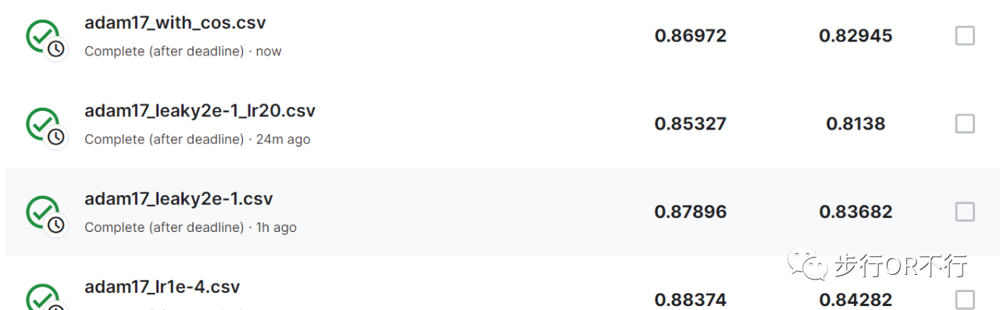

# 李宏毅2023机器学习hw1

## 1 Preparation
### 1.1 Objective
利用深度神经网络（DNN）求解回归（Regression）问题

理解基本的深度神经网络训练技巧（比如：超参数调整，特征选择，正则化等）

熟悉深度学习PyTorch框架 

### 1.2 Task Description
数据来源：Delphi group @ CMU 

任务内容：给定美国各州前两天的新冠检测为阳性的病人数据，预测接下来的第三天的新冠检测为阳性的人数。


### 1.3 Data
在这个数据集中，一共有89个特征，前35个特征是各个州，它们构成35维的独热向量（One-hot Vector）接下来的特征将以三天为循环，其中每个循环中有：COVID-like illness（5个），诸如戴口罩等可能会引起或者预防新冠的一些行为（5个），相信戴口罩，保持距离有效的信念（2个），担心感染新冠，担心经济的心理（2个），外界环境因素（3个）以及被检测出的新冠阳性人数（1个）。需要注意的是，我们关心的就是第三天的最后一个特征。
### 1.4 Evaluation Metric
对于回归问题，我们一般都会采用MSE作为损失函数，此外，对于本次作业，simple, medium, strong, boss baseline的标准如下图所示：


## 2 Code
### 2.1 Feature Selection
在本实验中，第一步需要进行特征筛选，因为不是所有的特征都是有用的。在机器学习任务中，通常选择的是sklearn中的SelectKBest函数，其具体做法是根据我们的domain knowledge对特征进行一些选择。

在这里我们选择使用SelectKBest函数去选择最相关的$k$个特征，而这个相关性的衡量，选择的是fregression函数，具体的代码如下：
```python
from sklearn.feature_selection import SelectKBest
from sklearn.feature_selection import f_regression
train_data = pd.read_csv('./covid_train.csv')
train_data.head()
# iloc[]函数，属于pandas库，即对数据进行位置索引，从而在数据表中提取出相应的数据。
x_data, y_data= train_data.iloc[:, 0:88], train_data.iloc[:, 88]

k = 17 # 选择k个相关性最强的特征，是超参之一
# 调用sklearn中的SelectKBest函数
'''
  SelectKBest:
    score_func: 评估指标，可选值包括：卡方检验（chi2）、互信息（mutual_info_classif、mutual_info_regression）等，默认为卡方检验。
    k: 选择排名靠前的k个特征，默认为10。

'''

selector = SelectKBest(score_func=f_regression, k=k)
result = selector.fit(x_data, y_data)

# result.scores_ includes scores for each features
# np.argsort sort scores in ascending order by index, we reverse it to make it descending.
idx = np.argsort(result.scores_)[::-1] # 每个feature关于score_func的倒序排序的index
print(f'Top {k} Best feature score ')
print(result.scores_[idx[:k]]) # 选取前k个特征

print(f'\nTop {k} Best feature index ')
print(idx[:k])

print(f'\nTop {k} Best feature name')
print(x_data.columns[idx[:k]])

selected_idx = list(np.sort(idx[:k]))
print(selected_idx)
print(x_data.columns[selected_idx])
```
经过实验发现，当我们选取$k=2$时，特征的名字正好是前两天测试为阳性的人数，我们对skeleton code仅在此处进行修改即可到达medium baseline。

当然我们肯定希望能有更好的特征，尝试一下$k=3$，发现新家进来的特征是covid-like illness的相关特征，这样的特征一共有$3×5=15$个。

对于这些特征，我们肯定是“要么全加进来，要么全不加进来”。我们同样可以用之前的思想，即将$k$加上1并观察新增的特征是什么类别，然后将这些类别的特征全部加上；如果效果反而变得更糟糕，就开始递减尝试。我们仅对$k$的值进行改变，采用最原始给出的网络框架，得到的分数如下表所示：

***

| $k$值 | Private Score | Public Score|
| --- | --- | --- |
| 2 | 1.1113 | 1.08301|
| 17 | 0.94774 | 0.89364 |
| 23 | 0.911 | 0.8798 |
| 26 | 0.88514 | 0.85301 |
| 29 | 0.94984 | 0.92561 |
***
我们发现，当$k=26$时，效果最好，且public和private两个榜单均过了strong baseline，在接下来的操作中，为了达到更好的效果，还可以通过选择不同的optimizer以及L2正则化等方法。
### 2.2 Different Optimizer
在课程中，我们对于优化问题采取的是naive gradient descent的做法，但在实际项目中，我们显然不会这么做，选择合适的优化器会对我们的模型训练产生重要的影响。

在深度学习中，常用的优化器有：SGD, SGD with momentum, Adagrad, RMSProp, Adam五个，在助教给出的skeleton code中，用到的优化器是SGD with momentum的方法，我们也可以用其他的方法，比如最流行的一个优化器是Adam优化器，代码如下：
```python
    # Define your optimization algorithm.
    # TODO: Please check https://pytorch.org/docs/stable/optim.html to get more available algorithms.
    # TODO: L2 regularization (optimizer(weight decay...) or implement by your self).
    # 初始skeleton采用SGD优化器，可以尝试其它的优化器
    # 在实践中，经常采用Adam优化器
    '''
      Some parameters of Adam Optimizers:
        params: Learnable parameters in the model that need to be updated
        lr: learning rate
        betas: smoothing constants, including beta1(0.9) and beta2(0.999)
        eps: some small constant adding to denominator to avoid dividing by 0
        weight_decay: Regularization term
        amsgrad: If True, use the maximum momentum, else use the current one
    '''


    '''optimizer = torch.optim.Adam(params=model.parameters(),
                lr=config['learning_rate']*20,
                eps=1e-8,
                weight_decay=1e-3,
                amsgrad=False)
    '''
    optimizer = torch.optim.Adam(model.parameters(), lr=config['learning_rate'],
        weight_decay=config['weight_decay])
    scheduler = torch.optim.lr_scheduler.CosineAnnealingWarmRestarts(optimizer,
                                        T_0=2, T_mult=2, eta_min=config['learning_rate'])
```
对于上述代码，调整的参数有学习率(learning rate)，正则化项(weight decay)等，其中，二者的参数可以是$[1e-1, 1e-2, 1e-3, 1e-4]$，可以采用随机搜索（Random Search）或者网格搜索（Grid Search）的方法。

### 2.3 Different Network Structures
根据助教的提示，我们可以通过更改网络结构对模型进行进一步优化，一个常见的做法是将原先采用的ReLU()激活函数替换成LeakyReLU()，代码如下：
```python
class My_Model(nn.Module):
    def __init__(self, input_dim):
        super(My_Model, self).__init__()
        # TODO: modify model's structure, be aware of dimensions.
        self.layers = nn.Sequential(
            nn.Linear(input_dim, 64),
            nn.LeakyReLU(),
            nn.Linear(64, 16),
            nn.LeakyReLU(),
            nn.Linear(16, 1),
        ) # nn.Sequential可以用来自定义网络层

    def forward(self, x):
        x = self.layers(x)
        x = x.squeeze(1) # (B, 1) -> (B)
        return x
```
### 2.4 More Improvement
当采用LeakyReLU作为激活函数、数，并采用Adam优化器+余弦退火调度器的方法，发现public榜单已经过了boss baseline，如下图所示：

我们接下来将对学习率和权重衰减依次进行调整，得到的结果如下表所示：
***

| Learning Rate | Weight Decay|  Private Score |Public Score|
| --- | --- | --- | ---|
| 1e-4 | 1e-4 | 0.83223| 0.80653|
| 1e-3 | 1e-4 | 0.8547 | 0.81002|
| 1e-2 | 1e-4 | 0.84877 | 0.81342|
***

## 3 Sum up
对于这个作业，我仅仅做到了Public Score达到了Boss Baseline，要达到双Boss Basline的分数还需要进行一些其他尝试或者微调。


