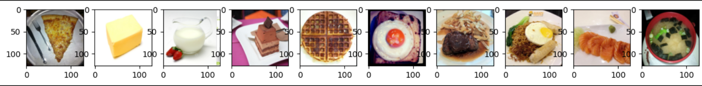
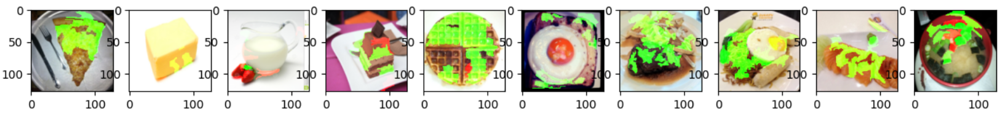
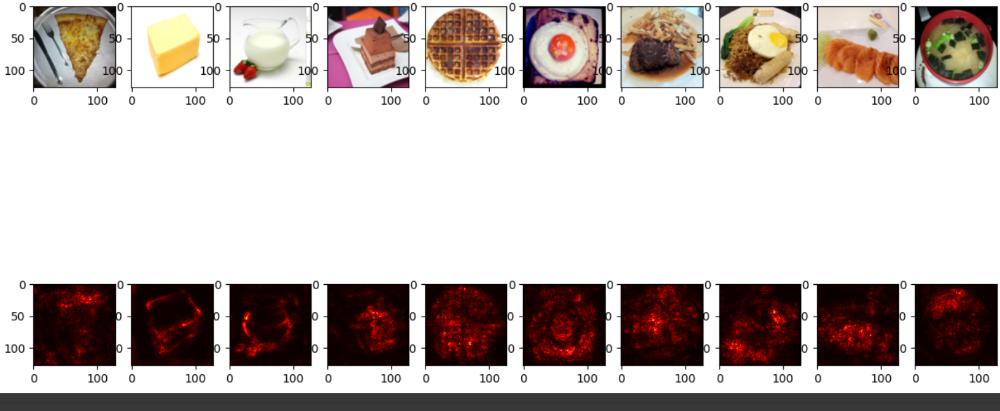
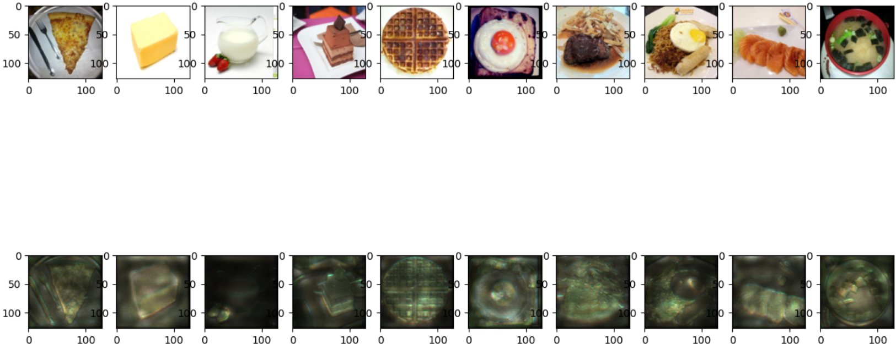
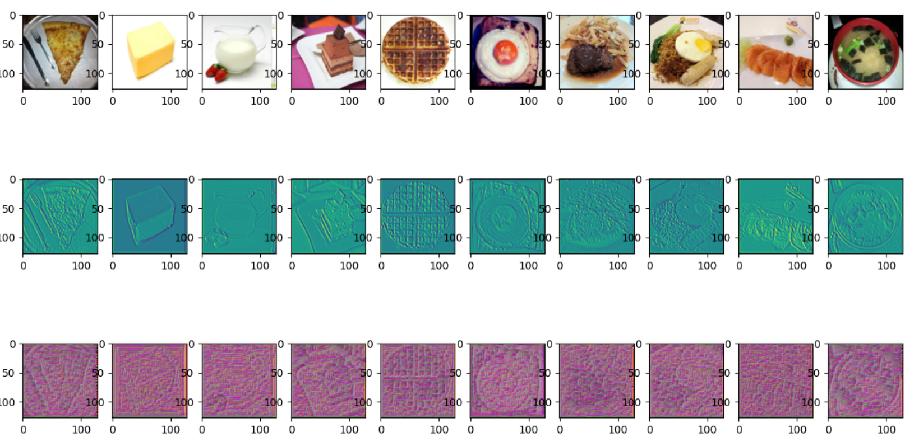
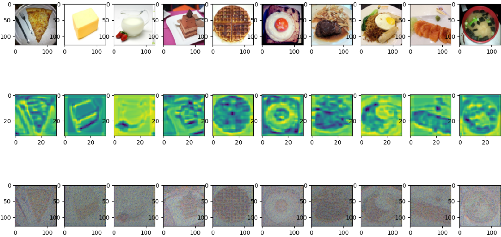
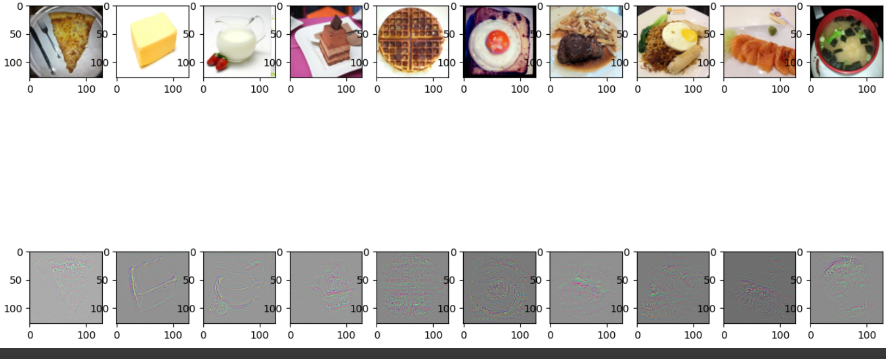
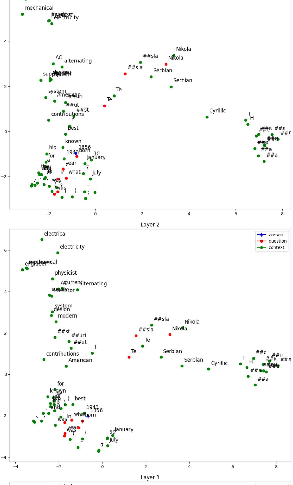
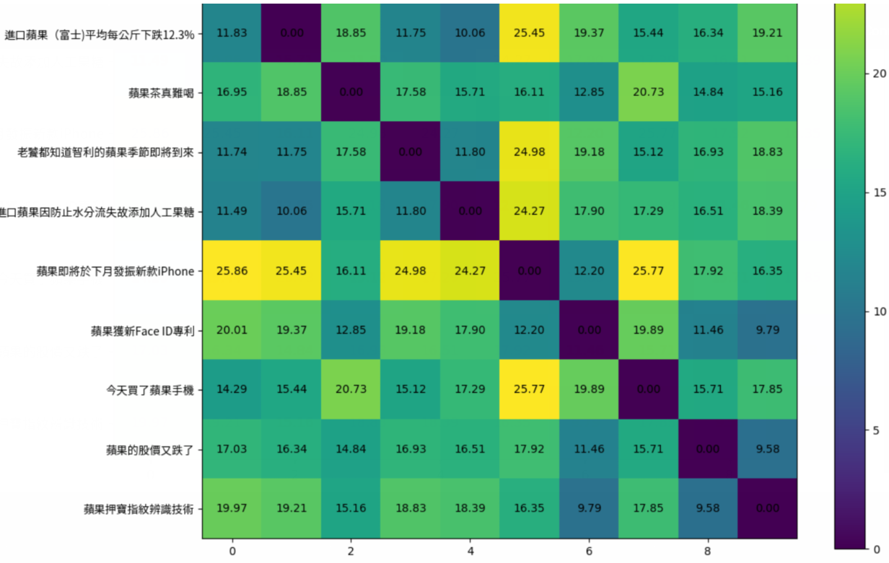

# 李宏毅机器学习hw9
## 1 Topic I: CNN Explanation
### 1.1 Task
运行助教给出的代码，分别对Lime，Saliency Map，Smooth Grad，Filter Visualization，Integrated Gradients进行结果可视化。

### 1.2 Observation
在本次作业中，我们只需要对10张图片进行观察，代码如下：
```python
img_indices = [i for i in range(10)]
images, labels = train_set.getbatch(img_indices)
fig, axs = plt.subplots(1, len(img_indices), figsize=(15, 8))
for i, img in enumerate(images):
  axs[i].imshow(img.cpu().permute(1, 2, 0))
# print(labels) # this line can help you know the labels of each image
```


### 1.3 LIME
Lime 是一个用于解释机器学习分类器正在做什么的包。我们可以先用它来观察模型，代码及其解释如下：
```python
def predict(input):
    # input: numpy array, (batches, height, width, channels)
    model.eval()
    input = torch.FloatTensor(input).permute(0, 3, 1, 2)
    # 将输入数据从numpy array转换为PyTorch的FloatTensor，并调整维度顺序
    # pytorch tensor, (batches, channels, height, width)
    output = model(input.cuda())
    # 使用模型进行预测，并将结果移动到GPU上（如果可用）
    return output.detach().cpu().numpy()
    # 将预测结果从GPU上取下来，并转换为numpy array格式

def segmentation(input):
    # 使用skimage库将图像分割成200个区域
    return slic(input, n_segments=200, compactness=1, sigma=1, start_label=1)

fig, axs = plt.subplots(1, len(img_indices), figsize=(15, 8))
# 创建一个图形窗口和子图区域，用于展示解释结果
# img_indices 是一个索引列表，表示要处理的图像索引
np.random.seed(16)
# 设置随机种子以确保结果可重复

for idx, (image, label) in enumerate(zip(images.permute(0, 2, 3, 1).numpy(), labels)):
    # 遍历图像和标签数据
    x = image.astype(np.double)
    # 将图像数据转换为double类型的numpy array
    explainer = lime_image.LimeImageExplainer()
    # 创建LimeImageExplainer对象，用于解释图像分类模型
    explanation = explainer.explain_instance(image=x, classifier_fn=predict, segmentation_fn=segmentation)
    # 使用Lime进行解释，传入图像、预测函数和分割函数
    
    lime_img, mask = explanation.get_image_and_mask(
                                label=label.item(),
                                positive_only=False,
                                hide_rest=False,
                                num_features=11,
                                min_weight=0.05
                            )
    # 获取Lime解释的图像及掩码
    # label表示类别标签，positive_only表示仅显示与该类别相关的特征，
    # hide_rest表示隐藏与该类别无关的特征，num_features表示显示的特征数量，min_weight表示最小权重
    axs[idx].imshow(lime_img)
    # 在子图中显示Lime解释的图像

plt.show()
plt.close()
# 展示图像并关闭图形窗口
```
结果


* 问题1：观察图片编号6使用Lime套件的结果：绿色集中在图片中食物部分

* 问题2：观察图片编号1使用Lime套件的结果：有一部分轮廓对模型正相关，有些轮廓对模型负相关

* 问题3：Lime套件颜色的意义：绿色代表正相关，红色代表负相关

* 问题4：观察图片编号4，包含了右侧褐色肉排与左侧的黄色十五，使用Lime套件之后的结果展示这两个部分如何影响模型进行分类：右侧褐色肉排为主要的正相关

### 1.4 Saliency Maps
显著图的作用：当我们改变图像的像素值时，损失对图像的偏微分值显示了损失的变化。这意味着像素的重要性。我们可以将其可视化，以展示图像的哪一部分对模型的判断贡献最大。
```python
def normalize(image):
  return (image - image.min()) / (image.max() - image.min())
  # 对图像进行归一化，将像素值缩放到 [0, 1] 的范围
  # 可以选择使用下一行的语句进行归一化，采用对数变换
  # return torch.log(image)/torch.log(image.max())

def compute_saliency_maps(x, y, model):
  model.eval()
  x = x.cuda()
  # 将输入数据移动到GPU上
  x.requires_grad_()
  # 设置x需要梯度，以便计算输入对于损失的梯度
  y_pred = model(x)
  # 使用模型进行预测
  loss_func = torch.nn.CrossEntropyLoss()
  # 交叉熵损失函数用于计算预测值与真实标签的差异
  loss = loss_func(y_pred, y.cuda())
  # 计算损失
  loss.backward()
  # 反向传播，计算梯度

  # saliencies = x.grad.abs().detach().cpu()
  saliencies, _ = torch.max(x.grad.data.abs().detach().cpu(),dim=1)
  # 获取输入对于损失的梯度，取每个像素维度上的绝对值
  # _ 表示临时变量，这里用于获取每个像素维度上的最大值
  # We need to normalize each image, because their gradients might vary in scale
  # 由于不同图像的梯度可能具有不同的尺度，因此需要对每个图像进行归一化
  saliencies = torch.stack([normalize(item) for item in saliencies])
  # 对每个图像的梯度映射进行归一化
  return saliencies

# images, labels = train_set.getbatch(img_indices)
saliencies = compute_saliency_maps(images, labels, model)

# visualize
fig, axs = plt.subplots(2, len(img_indices), figsize=(15, 8))
for row, target in enumerate([images, saliencies]):
  for column, img in enumerate(target):
    if row==0:
      axs[row][column].imshow(img.permute(1, 2, 0).numpy())
      # What is permute?
      # In pytorch, the meaning of each dimension of image tensor is (channels, height, width)
      # In matplotlib, the meaning of each dimension of image tensor is (height, width, channels)
      # permute is a tool for permuting dimensions of tensors
      # For example, img.permute(1, 2, 0) means that,
      # - 0 dimension is the 1 dimension of the original tensor, which is height
      # - 1 dimension is the 2 dimension of the original tensor, which is width
      # - 2 dimension is the 0 dimension of the original tensor, which is channels
    else:
      axs[row][column].imshow(img.numpy(), cmap=plt.cm.hot)

plt.show()
plt.close()
```
可视化图像和其对应的显著性图的代码如下：
```python
# images, labels = train_set.getbatch(img_indices)
# 假设已经定义了 train_set 对象，可以通过 getbatch 方法获取指定索引的图像和标签
saliencies = compute_saliency_maps(images, labels, model)
# 利用之前定义的 compute_saliency_maps 函数计算输入图像的显著性图

# visualize
fig, axs = plt.subplots(2, len(img_indices), figsize=(15, 8))
# 创建一个包含两行、len(img_indices)列的图形窗口，用于可视化图像和显著性图
for row, target in enumerate([images, saliencies]):
  # 遍历行，row 取值为 0 或 1
  for column, img in enumerate(target):
    # 遍历列，column 取值为 0 到 len(img_indices)-1
    if row==0:
      axs[row][column].imshow(img.permute(1, 2, 0).numpy())
      # 对于第一行，显示原始图像，需要调整维度顺序
      # 使用 permute(1, 2, 0) 对维度进行置换，将 PyTorch 的维度顺序 (channels, height, width)
      # 转换为 Matplotlib 的维度顺序 (height, width, channels)
    else:
      axs[row][column].imshow(img.numpy(), cmap=plt.cm.hot)
      # 对于第二行，显示显著性图，直接使用imshow显示
      # cmap=plt.cm.hot 表示使用热图颜色映射

plt.show()
plt.close()
# 展示图像和显著性图，并关闭图形窗口
```
结果如下图所示：


* 问题5：Saliency Map是对何者具象化：loss对input tensor的偏微分值

* 问题6：在Saliency Map中，对每张图片的gradient做归一化的目的：降低不同图片gradient scale不同的影响

* 问题7：图片编号0的Saliency Map红点分布的情况最像：立方体
* 问题8：图片编号1的Saliency Map红点分布呈水壶状，其中把手的位置靠近图片右侧
* 问题9：图片编号2的Saliency Map中，红点分布的情况没有明确分布于图片中的任意位置


### 1.5 Smooth Grad
Smooth grad的方法是，在图片中随机地加入noise，然后得到不同的heatmap，把这些heatmap平均起來就得到一个比較能抵抗noisy gradient的結果。
参考：https://arxiv.org/pdf/1706.03825.pdf

Smooth Grad具体的做法和Saliency Map差不太多，只是加上了随机噪声，代码如下：
```python
def normalize(image):
  return (image - image.min()) / (image.max() - image.min())
# 对图像进行归一化，将像素值缩放到 [0, 1] 的范围

def smooth_grad(x, y, model, epoch, param_sigma_multiplier):
  model.eval()
  # x = x.cuda().unsqueeze(0)

  mean = 0
  sigma = param_sigma_multiplier / (torch.max(x) - torch.min(x)).item()
  # 计算高斯噪声的标准差，用于生成平滑渐变
  smooth = np.zeros(x.cuda().unsqueeze(0).size())
  # 初始化一个与输入图像大小相同的数组，用于存储平滑渐变的累积值
  for i in range(epoch):
    # 进行多次迭代以获得平均效果
    # 使用 Variable 生成随机噪声
    noise = Variable(x.data.new(x.size()).normal_(mean, sigma**2))
    x_mod = (x + noise).unsqueeze(0).cuda()
    x_mod.requires_grad_()

    y_pred = model(x_mod)
    # 使用模型进行预测
    loss_func = torch.nn.CrossEntropyLoss()
    loss = loss_func(y_pred, y.cuda().unsqueeze(0))
    # 计算预测与真实标签的交叉熵损失
    loss.backward()

    # 类似于计算显著性图中的方法，获取输入对于损失的梯度
    smooth += x_mod.grad.abs().detach().cpu().data.numpy()
  smooth = normalize(smooth / epoch)  # 对平滑渐变进行归一化
  # smooth = smooth / epoch # 尝试取消归一化，回答问题
  return smooth

# images, labels = train_set.getbatch(img_indices)
# 与前面相同，获取图像和标签

smooth = []
for i, l in zip(images, labels):
  smooth.append(smooth_grad(i, l, model, 500, 0.4))
# 对每张图像计算平滑渐变，500次迭代，标准差为0.4
smooth = np.stack(smooth)
# 将结果堆叠成一个数组
# print(smooth.shape)

fig, axs = plt.subplots(2, len(img_indices), figsize=(15, 8))
# 创建一个包含两行、len(img_indices)列的图形窗口，用于可视化图像和平滑渐变
for row, target in enumerate([images, smooth]):
  # 遍历行，row 取值为 0 或 1
  for column, img in enumerate(target):
    # 遍历列，column 取值为 0 到 len(img_indices)-1
    axs[row][column].imshow(np.transpose(img.reshape(3,128,128), (1,2,0)))
    # 显示图像，需要将数组维度转换为正确的顺序
```
结果如下图所示：


* 问题10：Smooth Grad是由随机加入噪声观察的模型产生的Saliency Map解释模型的判断

* 问题11：Saliency Map和Smooth Grad的区别在于：Smooth Grad强调的部分更接近于图片中食物的位置

* 问题12：图片编号9的Smooth Gra的亮点主要为汤碗的轮廓

* 问题13：在Smooth Grad计算完成后，没有使用normalize会造成无法观察到亮点部位

### 1.6 Filter Explanation
在Filter Explanation中，我们想知道某一个filter到底认出了什么，我们会做以下两件事情：

* Filter activation：挑几张图片出來，看图片中哪些位置会activate该filter
* Filter visualization：找出可以最大程度的activate该filter的图片

通常的做法是直接把image丟进model，一路forward到底，但这样的做法的麻烦之处在于：更改了forward的output可能会让其他部分的code要跟着改动。因此 pytorch提供了方便的 solution: hook，代码如下所示：
```python
def normalize(image):
  return (image - image.min()) / (image.max() - image.min())
# 对图像进行归一化，将像素值缩放到 [0, 1] 的范围

layer_activations = None
# 全局变量，用于存储卷积层的激活响应

def filter_explanation(x, model, cnnid, filterid, iteration=100, lr=1):
  # x: 输入图像
  # model: 模型
  # cnnid: 卷积层的id
  # filterid: 滤波器的id
  # iteration: 迭代次数
  # lr: 学习率
  model.eval()

  def hook(model, input, output):
    global layer_activations
    layer_activations = output
  # 定义一个hook函数，用于保存卷积层的激活响应

  hook_handle = model.cnn[cnnid].register_forward_hook(hook)
  # 当模型通过cnnid层前向传播时，会先调用hook函数
  # hook函数保存cnnid层的输出
  # 完成前向传播后，我们将得到损失和卷积层的激活响应

  model(x.cuda()) # 进行前向传播

  # 获取特定滤波器的激活响应
  filter_activations = layer_activations[:, filterid, :, :].detach().cpu()

  # 滤波器可视化：找到能够激活滤波器最多的图像
  x = x.cuda()
  x.requires_grad_()
  # 输入图像梯度
  optimizer = Adam([x], lr=lr)
  # 使用优化器修改输入图像，以增强滤波器的激活响应
  for iter in range(iteration):
    optimizer.zero_grad()
    model(x)

    objective = -layer_activations[:, filterid, :, :].sum()
    # 我们希望最大化滤波器的激活响应总和
    # 因此添加了负号

    objective.backward()
    # 计算梯度
    optimizer.step()
    # 修改输入图像以最大化滤波器的激活响应
  filter_visualizations = x.detach().cpu().squeeze()

  # 不要忘记移除hook
  hook_handle.remove()
  # 注册hook后，模型会保持hook存在，所以必须在使用后移除它
  # 如果需要再次使用，只需注册一个新的hook

  return filter_activations, filter_visualizations
```
通过过滤器（Filter）的可视化来解释卷积神经网络（CNN）模型的决策过程，代码如下：
```python
images, labels = train_set.getbatch(img_indices)
# 获取图像和标签

filter_activations, filter_visualizations = filter_explanation(images, model, cnnid=6, filterid=0, iteration=100, lr=0.1)
# 使用 filter_explanation 函数计算指定CNN层和过滤器的激活图和可视化图

fig, axs = plt.subplots(3, len(img_indices), figsize=(15, 8))
# 创建一个包含三行、len(img_indices)列的图形窗口，用于可视化原始图像、过滤器激活图和过滤器可视化图

# Plot original images
for i, img in enumerate(images):
  axs[0][i].imshow(img.permute(1, 2, 0))
# 在第一行显示原始图像，需要调整维度顺序

# Plot filter activations
for i, img in enumerate(filter_activations):
  axs[1][i].imshow(normalize(img))
# 在第二行显示过滤器的激活图，使用 normalize 进行归一化

# Plot filter visualization
for i, img in enumerate(filter_visualizations):
  axs[2][i].imshow(normalize(img.permute(1, 2, 0)))
# 在第三行显示过滤器的可视化图，需要调整维度顺序，并使用 normalize 进行归一化

plt.show()
plt.close()
# 展示图像和可视化结果，并关闭图形窗口
```
结果如下图所示：



* 问题14：$cnnid = 6$的filter visualization观察的是Conv2d()的输出。
* 问题15：靠近输出端的cnn layer的filter activation与靠近输入端的cnn layer的filter activation相比，较为模糊，但是activate的位置大致相似。
* 问题16：观察图片编号1在$cnnid=15, filterid=0$的filter activation结果，图片的外围轮廓最能activate这个filter。
* 问题17：Filter Activation中观察的是：图片的哪些部位会activate特定的filter；什么样的图片最容易activate特定的filter。

### 1.7 Integrated Gradients
Integrated Gradients，用于计算集成梯度以解释深度学习模型的决策过程，其python代码如下：
```python
class IntegratedGradients():
    def __init__(self, model):
        self.model = model
        self.gradients = None
        # 初始化 IntegratedGradients 类，传入模型，并初始化梯度为 None
        # 将模型设为评估模式
        self.model.eval()

    def generate_images_on_linear_path(self, input_image, steps):
        # 生成沿着线性路径的缩放 xbar 图像
        xbar_list = [input_image*step/steps for step in range(steps)]
        return xbar_list

    def generate_gradients(self, input_image, target_class):
        # 获取输入图像的梯度
        input_image.requires_grad=True
        # 设置输入图像需要计算梯度
        # 前向传播
        model_output = self.model(input_image)
        # 梯度清零
        self.model.zero_grad()
        # 为反向传播设置目标
        one_hot_output = torch.FloatTensor(1, model_output.size()[-1]).zero_().cuda()
        one_hot_output[0][target_class] = 1
        # 反向传播
        model_output.backward(gradient=one_hot_output)
        self.gradients = input_image.grad
        # 将 PyTorch 变量转换为 numpy 数组
        # [0] 用于去除第一个通道 (1,3,128,128)
        gradients_as_arr = self.gradients.data.cpu().numpy()[0]
        return gradients_as_arr

    def generate_integrated_gradients(self, input_image, target_class, steps):
        # 生成 xbar 图像
        xbar_list = self.generate_images_on_linear_path(input_image, steps)
        # 初始化一个由零组成的图像
        integrated_grads = np.zeros(input_image.size())
        for xbar_image in xbar_list:
            # 从 xbar 图像生成梯度
            single_integrated_grad = self.generate_gradients(xbar_image, target_class)
            # 将来自 xbar 图像的重新缩放的梯度相加
            integrated_grads = integrated_grads + single_integrated_grad/steps
        # [0] 用于去除第一个通道 (1,3,128,128)
        return integrated_grads[0]

def normalize(image):
    return (image - image.min()) / (image.max() - image.min())
```
结果如下所示：
```python
# put the image to cuda
images, labels = train_set.getbatch(img_indices)
images = images.cuda()
# 获取图像和标签，并将图像移动到 GPU 上

IG = IntegratedGradients(model)
# 初始化 IntegratedGradients 类

integrated_grads = []
for i, img in enumerate(images):
  img = img.unsqueeze(0)
  # 在第一维度上增加一个维度，变成 (1, channels, height, width)，以满足模型输入的要求
  integrated_grads.append(IG.generate_integrated_gradients(img, labels[i], 10))
# 使用 IntegratedGradients 类计算图像的集成梯度，10 为步数

fig, axs = plt.subplots(2, len(img_indices), figsize=(15, 8))
# 创建一个包含两行、len(img_indices)列的图形窗口，用于可视化原始图像和集成梯度

# Plot original images
for i, img in enumerate(images):
  axs[0][i].imshow(img.cpu().permute(1, 2, 0))
# 在第一行显示原始图像，需要调整维度顺序

# Plot integrated gradients
for i, img in enumerate(integrated_grads):
  axs[1][i].imshow(np.moveaxis(normalize(img), 0, -1))
# 在第二行显示集成梯度，需要调整维度顺序，并使用 normalize 进行归一化

plt.show()
plt.close()
# 展示图像和集成梯度，并关闭图形窗口
```


* 问题18：图片编号7的Integrated Gradient结果中，模型判断的依据是肉排本身所对应的pixels
* 问题19：当使用Integrated Gradient时，将generate_images_on_linear_path的steps调得更大时，并没有显著的影响
* 问题20：上述函数的主要作用是：在原图片与baseline之间产生连续的samples

## 2 Topic II: BERT explanation
### 2.1 Task
运行助教给出的代码，分别对Attention Visualization，Embedding Visualization，Embedding analysis进行结果可视化。

### 2.2 Attention Visualization
观察网站，如下所示：
```python
from IPython import display
display.IFrame("https://exbert.net/exBERT.html", width=1600, height=1600)
```
### 2.3 Embedding Visualization
通过可视化 BERT 模型的嵌入空间，观察在不同层中，通过隐藏状态的变换，模型是如何处理输入文本
```python
# Tokenize and encode question and paragraph into model's input format
inputs = Tokenizer(questions[QUESTION-1], contexts[QUESTION-1], return_tensors='pt')
# 使用分词器将问题和段落编码成模型输入的格式

# Get the [start, end] positions of [question, context] in encoded sequence for plotting
question_start, question_end = 1, inputs['input_ids'][0].tolist().index(102) - 1
context_start, context_end = question_end + 2, len(inputs['input_ids'][0]) - 2
# 获取编码序列中[question, context]的[start, end]位置，用于绘图

outputs_hidden_states = torch.load(f"hw9_bert/output/model_q{QUESTION}")
# 加载模型的隐藏状态输出，该输出包含了每个层的隐藏状态

##### Traverse hidden state of all layers #####
# 遍历所有层的隐藏状态
# "outputs_hidden_state" 是一个包含13个元素的元组，第一个元素是嵌入输出，其余12个元素是每一层的注意力隐藏状态
for layer_index, embeddings in enumerate(outputs_hidden_states[1:]): # 1st element is skipped
    # 跳过第一个元素，因为第一个元素是嵌入输出

    # "embeddings" has shape [1, sequence_length, 768], where 768 is the dimension of BERT's hidden state
    # "embeddings" 的形状是 [1, sequence_length, 768]，其中768是BERT隐藏状态的维度
    # 使用PCA（主成分分析）将"embeddings"的维度从768减少到2
    reduced_embeddings = PCA(n_components=2, random_state=0).fit_transform(embeddings[0])

    ##### Draw embedding of each token #####
    # 绘制每个标记的嵌入
    for i, token_id in enumerate(inputs['input_ids'][0]):
        x, y = reduced_embeddings[i] # 嵌入有2个维度，分别对应一个点
        word = Tokenizer.decode(token_id) # 将标记解码回单词
        # 使用不同颜色的散点图表示答案、问题和上下文的标记点
        if word in answers[QUESTION-1].split(): # 检查标记是否在答案中
            plt.scatter(x, y, color='blue', marker='d')
        elif question_start <= i <= question_end:
            plt.scatter(x, y, color='red')
        elif context_start <= i <= context_end:
            plt.scatter(x, y, color='green')
        else: # 跳过特殊标记 [CLS], [SEP]
            continue
        plt.text(x + 0.1, y + 0.2, word, fontsize=12) # 在点旁边标注单词

    # 绘制“空”点以显示标签
    plt.plot([], label='answer', color='blue', marker='d')
    plt.plot([], label='question', color='red', marker='o')
    plt.plot([], label='context', color='green', marker='o')
    plt.legend(loc='best') # 显示图中描述元素的区域
    plt.title('Layer ' + str(layer_index + 1)) # 添加标题到图中
    plt.show() # 显示图
```
结果如下（一共有12层）：


### 2.4 Embedding Analysis
TODO CODE
```python
# Index of word selected for embedding comparison. E.g. For sentence "蘋果茶真難喝", if index is 0, "蘋 is selected"
# The first line is the indexes for 蘋; the second line is the indexes for 果
select_word_index = [4, 2, 0, 8, 2, 0, 0, 4, 0, 0]
# select_word_index = [5, 3, 1, 9, 3, 1, 1, 5, 1, 1]

def l2_norm(a):
    return ((a**2).sum())**0.5
def euclidean_distance(a, b):
    # Compute euclidean distance (L2 norm) between two numpy vectors a and b
    return l2_norm(a - b)

def cosine_similarity(a, b):
    # Compute cosine similarity between two numpy vectors a and b
    eps = 1e-8
    return (a * b).sum() / (l2_norm(a) * l2_norm(b) + eps)

# Metric for comparison. Choose from euclidean_distance, cosine_similarity
METRIC = euclidean_distance

def get_select_embedding(output, tokenized_sentence, select_word_index):
    # The layer to visualize, choose from 0 to 12
    LAYER = 12
    # Get selected layer's hidden state
    hidden_state = output.hidden_states[LAYER][0]
    # Convert select_word_index in sentence to select_token_index in tokenized sentence
    select_token_index = tokenized_sentence.word_to_tokens(select_word_index).start
    # Return embedding of selected word
    return hidden_state[select_token_index].numpy()
```
可视化的代码和结果如下：
```python
# Tokenize and encode sentences into model's input format
tokenized_sentences = [tokenizer(sentence, return_tensors='pt') for sentence in sentences]

# Input encoded sentences into model and get outputs
with torch.no_grad():
    outputs = [model(**tokenized_sentence) for tokenized_sentence in tokenized_sentences]

# Get embedding of selected word(s) in sentences. "embeddings" has shape (len(sentences), 768), where 768 is the dimension of BERT's hidden state
embeddings = [get_select_embedding(outputs[i], tokenized_sentences[i], select_word_index[i]) for i in range(len(outputs))]

# Pairwse comparsion of sentences' embeddings using the metirc defined. "similarity_matrix" has shape [len(sentences), len(sentences)]
similarity_matrix = pairwise_distances(embeddings, metric=METRIC)

##### Plot the similarity matrix #####
plt.rcParams['figure.figsize'] = [12, 10] # Change figure size of the plot
plt.imshow(similarity_matrix) # Display an image in the plot
plt.colorbar() # Add colorbar to the plot
plt.yticks(ticks=range(len(sentences)), labels=sentences, fontproperties=myfont) # Set tick locations and labels (sentences) of y-axis
plt.title('Comparison of BERT Word Embeddings') # Add title to the plot
for (i,j), label in np.ndenumerate(similarity_matrix): # np.ndenumerate is 2D version of enumerate
    plt.text(i, j, '{:.2f}'.format(label), ha='center', va='center') # Add values in similarity_matrix to the corresponding position in the plot
plt.show() # Show the plot
```

在上图中，向量和本身的距离最近，因此对角线上的值为0，颜色最深，当然对于不同的token，该热力图的颜色深浅也会有所不同。